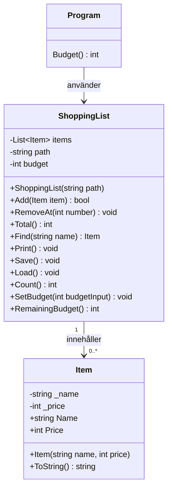

# Inköpslista

## Felrapport

Startkoden innehöll sex fel: fyra som fick programmet att krascha, ett som gav fel resultat och ett som dolde att något gick fel.

### 1. Programmet kraschade direkt vid start (krasch)

**Vad som hände:** `IndexOutOfRangeException` i `ShoppingList.Load` så fort programmet startade.

**Varför:** `Save` skriver `\r\n` efter varje rad, även den sista. `Load` delade texten på `\n`, så den sista "raden" blev en tom sträng. `"".Split(';')` ger bara ett element, och `parts[1]` fanns inte. Dessutom låg `\r` kvar i slutet av varje rad, så varunamnen blev t.ex. `"Ost\r"`. Därför hittade sökningen inte varor som syntes i listan.

**Lösning:** `Trim()` på hela texten innan den delas upp, så att den tomma sista raden försvinner, och `Trim()` på varje rad, så att `\r` tas bort.

### 2. Programmet kraschade om `items.txt` saknades (krasch)

**Vad som hände:** `FileNotFoundException` i `Load` när filen inte fanns.

**Varför:** `File.ReadAllText` kastar ett undantag om filen saknas, och ingenting fångade det.

**Lösning:** En `try`/`catch (FileNotFoundException)` runt inläsningen. Programmet skriver ut ett meddelande och startar med en tom lista. Den fångar bara just det undantaget, inte `Exception`.

### 3. Programmet kraschade när man skrev bokstäver i stället för tal (krasch)

**Vad som hände:** `FormatException` när man skrev något annat än ett tal i menyn, i priset eller i numret, eller bara tryckte Enter.

**Varför:** All inmatning lästes med `int.Parse`, som kastar ett undantag när texten inte är ett tal.

**Lösning:** `int.TryParse` i en `while`-loop som frågar igen tills inmatningen är giltig. Loopen kontrollerar också att värdet är rimligt: menyval 1–5 och pris minst 1.

### 4. Programmet kraschade när man tog bort en vara som inte finns (krasch)

**Vad som hände:** `ArgumentOutOfRangeException` i `ShoppingList.RemoveAt`, till exempel om man skrev `0` eller `99`.

**Varför:** Numret skickades direkt till `List.RemoveAt` utan någon kontroll av att det fanns en vara med det numret.

**Lösning:** En ny metod `Count()` i `ShoppingList`. `Program.cs` frågar igen tills numret ligger mellan 1 och antalet varor. Om listan är tom visas ett meddelande direkt, annars hade loopen aldrig kunnat godkänna något nummer.

### 5. Totalsumman var fel (fel resultat)

**Vad som hände:** Totalsumman blev för låg.

**Varför:** For-loopen i `Total()` började på `i = 1` i stället för `i = 0`, så den första varan räknades aldrig med.

**Lösning:** Loopen börjar nu på `i = 0`.

### 6. Sparningen dolde fel (dolt fel)

**Vad som hände:** Programmet skrev "Listan är sparad." även när sparningen misslyckades, t.ex. om filen var skrivskyddad eller öppen i ett annat program.

**Varför:** `Save` hade en tom `catch` som fångade alla undantag utan att göra något, och meddelandet skrevs ut efter `try`/`catch` oavsett resultat.

**Lösning:** "Listan är sparad." skrivs nu inne i `try`, så det visas bara om sparningen lyckades. Den tomma `catch` är ersatt med `catch (UnauthorizedAccessException)` (skrivskydd, saknad behörighet) och `catch (IOException)` (låst fil, full disk, mappen saknas), och båda visar ett felmeddelande.

### Övriga förbättringar

- Man kan inte ange ett tomt varunamn.
- Samma vara kan inte läggas till två gånger. `Program.cs` kontrollerar med `Find` om varan redan finns.

## Designval till Add metoden

     - Add returnerar false i stället för att kasta ett undantag.
     - Varför: att gå över budgeten är en förväntad situation, inte ett fel
     - Item kastar undantag eftersom en ogiltig vara är ett fel.
     - Vad Program.cs gör med svaret: kontrollerar bool-värdet och visar ett meddelande.

     ## Klassdiagram

